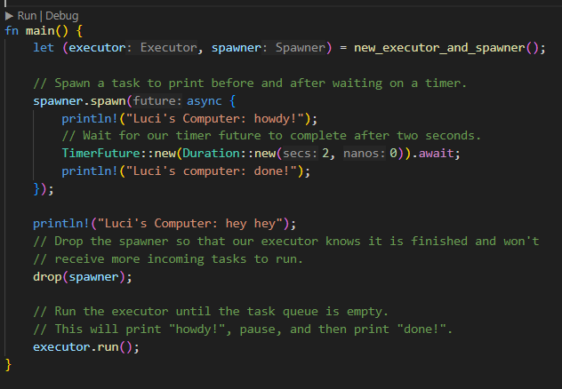
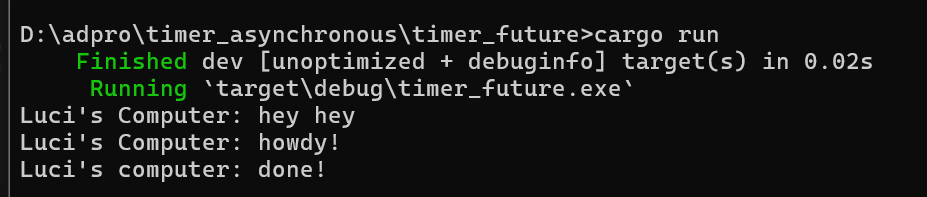
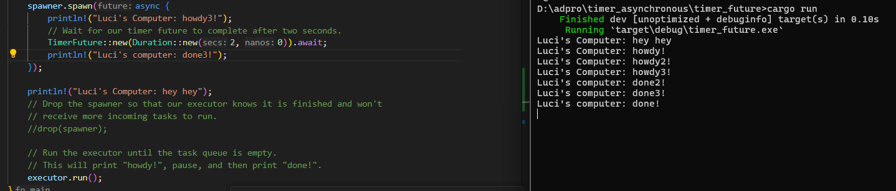
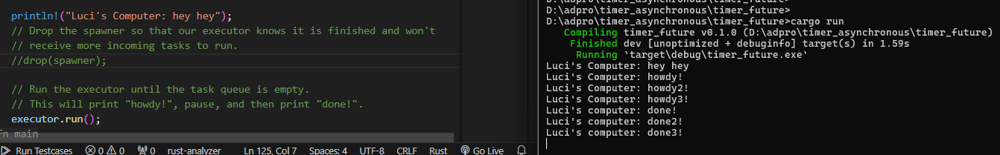
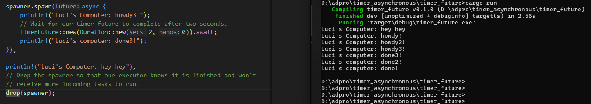

## Tutorial 1: Timer
### 1.2. Understanding how it works.
#### The modification

#### The execution

#### The explanation
Pada kode di atas, saya melakukan modifikasi dengan menambahkan _task_ untuk mencetak "hey hey". _Task_ tersebut berada di luar _task_ yang di-_spawn_ dalam `spawner.spawn(...);`. _Task_ yang berada di dalam `spawner.spawn(...);` akan dijalankan secara asinkronus, "terpisah" dari main program. Oleh karena itu, _task_ untuk mencetak "hey hey" dapat dijalankan terlebih dahulu. Dengan kata lain, program tidak perlu menunggu _task_ yang berada di dalam `spawner.spawn(...);` selesai dijalankan untuk menjalankan _task_ lain di main. Adapun _task_ yang berada di dalam `spawner.spawn(...);` adalah mencetak "howdy", kemudian menunggu selama 2 detik menggunakan `TimerFuture` dan terakhir mencetak "done!". Hasil eksekusinya seperti tampak pada gambar: program mencetak "hey hey", mencetak "howdy", menunggu 2 detik, kemudian mencetak "done!".
### 1.3. Multiple Spawn and removing drop
#### Try to remove and put it again

#### The explanation
Spawner berfungsi untuk menambahkan atau memasukkan _task_ ke dalam _queue_ milik executor. `drop(spawner)` berfungsi untuk memberi tahu executor bahwa semua _task_ sudah dimasukkan ke dalam _queue_. Dengan begitu, executor (sekaligus program) akan berhenti setelah semua _task_ yang ada di dalam _queue_ selesai dijalankan.  
Jika kode `drop(spawner)` dihapus, program kita tidak memberitahukan secara eksplisit pada `executor` kapan harus berhenti. Akibatnya `executor` tetap berjalan dan menunggu task baru yang akan di-_spawn_. Dalam program kita, sebenarnya tidak ada lagi _task_ baru yang perlu dijalankan. Akibatnya program akan terus berjalan dan tidak akan berhenti sampai kita menghentikannya secara manual.  
Perhatikan bahwa urutan cetak dari ketiga percobaan di atas berbeda-beda. Karena _task_ dijalankan secara bersamaan (asinkronus), urutan eksekusi task yang di- _spawn_ tidak dapat ditentukan.